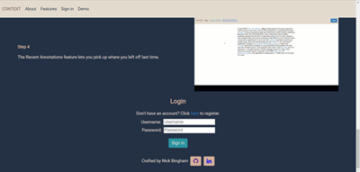
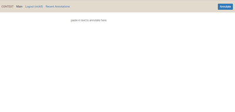
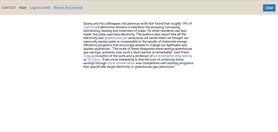
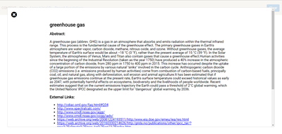
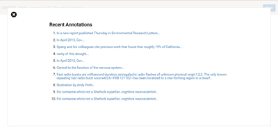

# Context

Context is a responsive, full-stack app that allows users to annotate a text's named entities with Wikipedia summaries (called abstracts) and external websites.

## Live Website

[http://contextservice.site/#](http://contextservice.site/#)

## Summary

Context was built around the idea that a user's reading experience on the web could be improved by providing, you guessed it, more context to the content being read.  By providing a brief (and sometimes not so brief) abstract (or definition, really) to a highlighted named entity along with external links to websites about that named entity, it is my hope that the user gets some added benefit. Context is an annotation service to take content from the web and add annotations. [This](https://github.com/EnshaednHiker/context) is the main entry point for the project with a detailed tutorial on both the server and web client.

Context is comprised of two main components: [server](https://github.com/EnshaednHiker/context-server) and [webclient](https://github.com/EnshaednHiker/context-webclient).

## Screenshots








# Server

## Getting Started

### Installing

```
>   git clone https://github.com/EnshaednHiker/context-server.git
>   cd context-server
>   npm install
```

### Launching

```
> npm start
```

### Testing

```
> npm test
```
Unit tests use [Mocha](https://mochajs.org/) and [Chai](http://chaijs.com/).

## Continuous Integration 

[CircleCI](https://circleci.com/) hooked up to [Heroku](https://www.heroku.com/) to keep continuous integration chugging along.

### Security

User credentials are encrypted with [jsonwebtokens](https://github.com/auth0/node-jsonwebtoken) and decrypted with [passport](http://www.passportjs.org/).

### Database

MongoDB hosted on [mLab](http://docs.mlab.com/).

## Server Built With

* [NODE.JS](https://nodejs.org/en/docs/) - First half of server
* [EXPRESS.JS](https://redux.js.org/) - Second half of server
* [MONGODB](https://docs.mongodb.com/) - Database
* [MONGOOSE](http://mongoosejs.com/docs/guide.html) - Data validation

## Author

* **Nick Bingham** - [EnshaednHiker](https://github.com/EnshaednHiker)

## Development Roadmap

* Retain paragraph separation in returned annotated strings
* Collapsible hamburger menu for mobile view
* Build proxy server of DBPedia Spotlight for avoid running the site in http issue. Currently, I have to host the site in http, not https, in order to access the DBPedia Spotlight API
* Social media elements with blog roll that shows user annotations
* Sharing social media site elements where study meets social media

## License

This project is licensed under the ISC License - see the [LICENSE.md](LICENSE.md) file for details

## Acknowledgments

* Hat tip to my mentors who helped to keep me mostly sane, my goals lofty but in reach, and on track.
